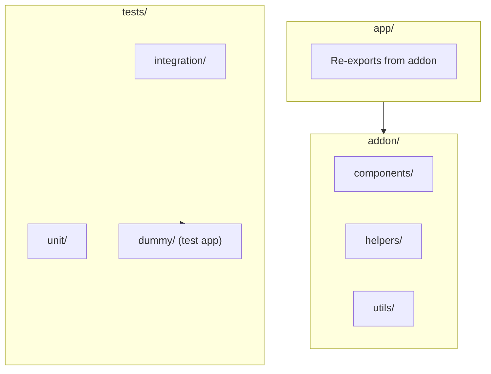

# Project Overview
Keywords: ember addon, cloudinary, image, video, fastboot, glimmer components

## Architecture

Ember CLI addon providing Cloudinary integration without jQuery dependency. Designed for Ember Octane with Glimmer components.



## Directory Structure

- `addon/` - Main addon source code
  - `components/` - Glimmer components (cloudinary-image, cloudinary-video, cloudinary-resource-list)
  - `helpers/` - Template helpers (safe-cloudinary-url)
  - `utils/` - Utility functions (variable-formatter)
- `app/` - Re-exports for consuming applications
- `tests/` - QUnit tests with dummy application

## Configuration

Consuming apps configure via `config/environment.js`:
```javascript
cloudinary: {
  cloudName: 'your_cloud_name',
}
```

Components access config via `getOwner(this).resolveRegistration('config:environment')`.

## Rules
- MUST: Use Glimmer component syntax (`@glimmer/component`)
- MUST: Access config through `getOwner()` pattern
- PREFER: Octane patterns (tracked properties, native classes)
- AVOID: jQuery dependencies (addon is specifically jQuery-free)

## References
- Key files: addon/components/*.js, addon/utils/variable-formatter.js
- Related contexts: patterns/context.md, cloudinary/api/context.md
